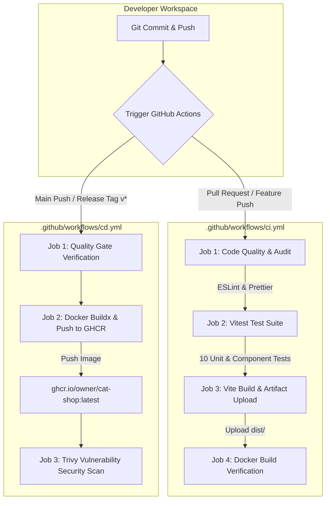

# 🐱 Cat Shop — React SPA & DevOps CI/CD Showcase

A modern, responsive React 18 e-commerce web storefront for cat products (toys, food, beds, accessories), paired with an **enterprise-grade DevOps CI/CD pipeline**, multi-stage Docker containerization, custom Nginx SPA routing, and automated security scanning.

---

## 🚀 Quick Start (Local Development)

### Prerequisites

- Node.js (v18 or higher recommended)
- npm (v9 or higher recommended)
- Docker (optional, for containerized execution)

### 1. Local Node Setup

```bash
# Install dependencies
npm install

# Start Vite development server with HMR
npm run dev
```

Open your browser at `http://localhost:5173`.

### 2. Local Docker Execution

```bash
# Build multi-stage production Docker image
docker build -t cat-shop:latest .

# Run containerized Nginx web server on port 8080
docker run -p 8080:80 --name cat-shop-app cat-shop:latest
```

Access the application at `http://localhost:8080`. Test client-side navigation (e.g., direct navigation to `http://localhost:8080/cart`) to verify Nginx SPA fallback routing.

---

## 🛠️ Package Scripts & Pipeline Commands

The project includes standardized npm scripts required by local workflows and CI pipelines:

| Script                 | Command              | Description                              |
| :--------------------- | :------------------- | :--------------------------------------- |
| `npm run dev`          | `vite`               | Starts local development server          |
| `npm run build`        | `vite build`         | Compiles production bundle to `dist/`    |
| `npm run preview`      | `vite preview`       | Previews static production build locally |
| `npm run lint`         | `eslint .`           | Enforces code quality rules              |
| `npm run format:check` | `prettier --check .` | Verifies formatting compliance           |
| `npm run test`         | `vitest run`         | Runs Vitest unit & component test suite  |

---

## 🏗️ DevOps Architecture & CI/CD Pipeline



### Key DevOps Highlights

1. **Multi-Stage Dockerfile**:
   - **Stage 1 (Builder)**: Uses `node:18-alpine` to install dependencies (`npm ci`), run tests (`npm run test`), and build production assets (`npm run build`).
   - **Stage 2 (Runner)**: Uses minimal `nginx:alpine-slim` unprivileged runtime image to serve static assets with gzip compression, security headers (`X-Frame-Options`, `X-Content-Type-Options`), and SPA routing fallbacks.
2. **Automated CI Workflow (`ci.yml`)**:
   - **Linting & Formatting**: Enforces ESLint and Prettier compliance.
   - **Unit & Component Testing**: Runs 10 automated Vitest tests.
   - **Security Audit**: Scans npm dependencies for high/critical vulnerabilities.
   - **Docker Validation**: Verifies container build succeeds before code merges.
3. **Automated CD Workflow (`cd.yml`)**:
   - **GitHub Container Registry (GHCR)**: Automatically builds multi-arch container images and pushes tagged versions (`v1.0.0`, `sha-xyz`, `latest`) to `ghcr.io`.
   - **Security Scanning**: Integrates Aqua Security Trivy to scan published images for OS and library CVEs.

---

## 📂 Project Structure

```
cat-app/
├── .github/
│   └── workflows/
│       ├── ci.yml       # Continuous Integration workflow (Lint, Test, Build, Docker test)
│       └── cd.yml       # Continuous Delivery workflow (GHCR publish, Trivy security scan)
├── src/
│   ├── components/      # Reusable UI components (ProductCard, Header, Footer, CartIcon, Button)
│   ├── context/         # CartContext & cartReducer for global state management
│   ├── data/            # Mock products catalog (products.json)
│   ├── hooks/           # Custom React hooks (useCart)
│   ├── pages/           # Route views (Home, ProductDetail, Cart, Checkout, NotFound)
│   ├── test/            # Vitest unit & component test suites
│   ├── App.jsx          # Main application component & routes
│   └── index.css        # Global CSS design tokens & resets
├── Dockerfile           # Production multi-stage Docker configuration
├── nginx.conf           # Custom Nginx SPA configuration & security headers
├── eslint.config.js     # ESLint flat config
├── .prettierrc          # Prettier formatting configuration
└── package.json         # Project dependencies & CI scripts
```

---

## 🧪 Automated Test Suite

Run unit and component tests locally:

```bash
npm run test
```

The suite includes:

- **`src/test/cartReducer.test.js`**: Unit tests covering reducer actions (`ADD_ITEM`, `REMOVE_ITEM`, `UPDATE_QUANTITY`, `CLEAR_CART`).
- **`src/test/ProductCard.test.jsx`**: Component tests verifying product rendering and cart context dispatch.
- **`src/test/Cart.test.jsx`**: Component tests verifying cart subtotal calculations and empty cart state.
